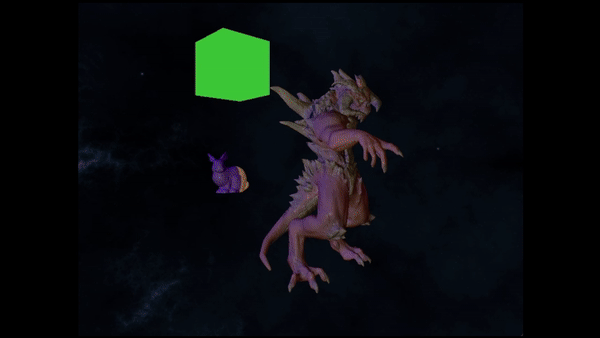

# Factory Game

This project is an OpenGL deferred renderer with plans to become a game engine, currently in development.

<div style="text-align: center;">
    
</div>


## Features
- **Deferred Rendering** – Uses G-buffer separation for Position, Normal, and Color channels.
- **ECS Architecture** – The rendering pipeline is built on an ECS system, ensuring efficient, on-demand updates only when necessary.
- **Cube Maps** – Utilized in `SkyboxPass` and `ShadowPass` (point lights).
- **Simple Frame Graph** – Each render pass inherits from `RenderPass` for compilation, resource management, and execution.
- **Script Interface** – Allows each `GameObject` to run its own custom scripts. The `Script` class provides an interface for defining custom logic for each object, with lifecycle functions like `start()`, `update()`, and `onDestroy()` that can be implemented per object.
- **GameObject Parent-Child Hierarchy** – Supports a parent-child structure for `GameObject` transformations, where child objects inherit transformations from their parent objects.
- **Debug Gizmos** - Draw wireframe gizmos for visual debugging

Markdown

## Engine Specifics

This section outlines some key implementation details and limitations of the engine.

### Components

The engine utilizes an Entity-Component-System (ECS) architecture powered by the [EnTT](https://github.com/skypjack/entt) library. The following core components are currently supported:

* **GameObject:** A thin abstraction layer over the ECS system, designed to simplify script development. Users can interact with "objects" similar to Unity, abstracting away direct entity management.
* **Position:** Stores the 3D world position of an entity (`glm::vec3`).
* **Rotation:** Stores the 3D rotation of an entity using a quaternion (`glm::quat`). Modifying this component directly updates the `EulerAngles` component and vice versa.
* **Scale:** Stores the 3D scale of an entity (`glm::vec3`).
* **EulerAngles:** Stores the 3D rotation of an entity using Euler angles (in degrees) (`glm::vec3`). *Note: While the engine primarily uses quaternions for internal calculations, Euler angles are maintained for potential use cases and editor integration.*
* **Rotation:** Bypass euler angles and modify the quaternion directly. Modifying the `Rotation` component will also update `EulerAngles` component and vice versa.
* **ModelMatrix:** A component that flags the entity's model matrix as dirty, triggering recalculation.
* **MetaData:** Stores basic information about the entity, such as its name (`std::string`).
* **Parent:** Indicates the parent entity in a hierarchical structure.
* **Children:** Stores a list of child entities.
* **Light:** Stores metadata of a light, which the engine processes into Shader Storage Buffer Objects (SSBOs) for rendering.
* **Mesh:** Stores all required data for a single mesh, including vertices, indices, normals, tangents, and bitangents.

### Rendering

**Limitations:**

* **Maximum Lights:** The engine currently supports up to 1000 lights to maintain performance. This limit can be adjusted in the codebase if needed.
* **Maximum Shadow Casters:** The number of simultaneous shadow casters is limited to 20, primarily due to hardware constraints.

**Features:**

* **Physically Based Rendering (PBR) Lighting Model:** Implements a PBR lighting model for realistic material rendering.
* **Point and Spot Lights:** Supports point, spot, and directional lights.
* **Optional Shadow Casting:** Point, spot, and directional lights can be configured to cast shadows.
* **Optional Parallax Occlusion Mapping:** If a `Mesh` `Material` has a `heightMap` texture, the engine will apply this feature.

### Miscellaneous

* **Forward Direction:** The local forward direction of entities is defined as the **negative Z-axis (-Z)**.

## Installation
```sh
git clone git@github.com:dominicaq/factorygame.git
```
## Downloading Additional Assets (Optional)
If you wish to download the additional 3D model assets along with the project, run:
```sh
git submodule update --init --recursive
```
## Build Instructions
1. Linux:
    ```sh
    mkdir build
    cd build
    cmake ..
    make
    ```
2. Windows:
    ```sh
    mkdir build
    cd build
    cmake ..
    cmake --build . --config Release
    ```
The compiled executable will be located in the `build/Release/FactoryGame.exe` directory on Windows.

## Dependencies
- A PC with OpenGL support (minimum OpenGL version 4.3)
- CMake 3.10 or higher
- A C++ compiler supporting C++17 or higher
